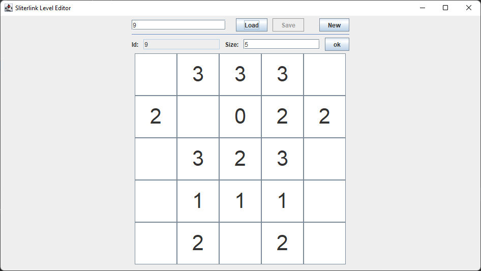
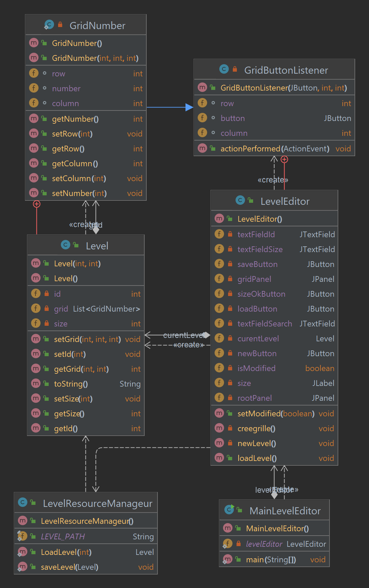

# Level Editor



## fonctionalitées
Le levelEditor a pour objective de faciliter la créer et la modification des niveaux de Slitherlink.
 
- Créer nouveaux un niveau avec un id unique
- Modifier un niveau existant

## utilisation
Il est destiné à être uniquement utilisé par les développeurs du jeu.
Donc je n'ai pas compilé le jar.
Il faut le compiler avec maven par vous-même. La classe à exécuter est `fr.levelEditor.MainLevelEditor`.

## diagramme de classe



## ficher de sauvegarde xml

- Le fichier est sauvegardé dans le dossier `src/main/resources/level/`
- le nom du fichier est `[id du niveau].xml`

Exemple de fichier de sauvegarde xml d'un niveau (niveau de la preview).
````xml
<?xml version="1.0" encoding="UTF-8" standalone="yes"?>
<level id="9">
    <size>5</size>
    <number column="1" row="0">3</number>
    <number column="2" row="0">3</number>
    <number column="3" row="0">3</number>
    <number column="0" row="1">2</number>
    <number column="2" row="1">0</number>
    <number column="3" row="1">2</number>
    <number column="4" row="1">2</number>
    <number column="1" row="2">3</number>
    <number column="2" row="2">2</number>
    <number column="3" row="2">3</number>
    <number column="1" row="3">1</number>
    <number column="2" row="3">1</number>
    <number column="3" row="3">1</number>
    <number column="1" row="4">2</number>
    <number column="3" row="4">2</number>
</level>
```